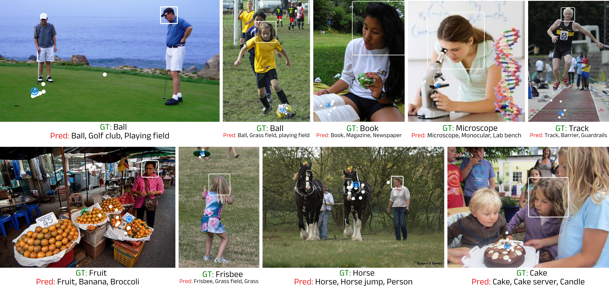

# Toward Semantic Gaze Target Detection



## Overview

**Authors:** Samy Tafasca, Anshul Gupta, Victor Bros, Jean-marc Odobez 

[`Paper`](https://proceedings.neurips.cc/paper_files/paper/2024/file/dbeb7e621d4a554069a6a775da0f7273-Paper-Conference.pdf) | [`Video`](https://neurips.cc/virtual/2024/poster/96207) | [`Poster`](https://neurips.cc/media/PosterPDFs/NeurIPS%202024/96207.png?t=1731674687.8646579) | [`BibTeX`](#citation)


This is the official Github repository for the paper "Toward Semantic Gaze Target Detection" published in NeurIPS 2024. Here, you will find the code, data artifacts, and model checkpoints.

## Setup
### 1. Create the Conda environment
First, we need to clone the repository 
```shell
git clone https://github.com/idiap/semgaze.git
cd semgaze
```

Next, create the conda environment and install the necessary packages
```shell
conda create -n semgaze python=3.11.0
conda activate semgaze
pip install -r requirements.txt
```

### 2. Download data
In order to reproduce the experiments, you will need to download the GazeFollow and GazeHOI datasets. GazeFollow can be downloaded from [here](https://www.dropbox.com/s/3ejt9pm57ht2ed4/gazefollow_extended.zip?dl=0), while GazeHOI instructions and annotations are provided in this repository.

First, you can download all resources from the following [link](https://zenodo.org/records/17107341). Unzip the file and place the folders `data`, `weights` and `checkpoints` under the project directory.

The folder `data` contains instructions and annotations as well as CLIP embeddings for class labels for both GazeFollow and GazeHOI. Refer to `data/README.md` for more details.

The folder `weights` contains pre-trained models used to initialize the architecture when training on GazeFollow. This includes a ResNet18 pre-trained on Gaze360 to initialize the gaze encoder and a [MultiMAE](https://github.com/EPFL-VILAB/MultiMAE) pre-trained on Imagenet to initialize the image encoder. Furthermore, we provide the weights of a head detector to automatically detect people in the images for demo purposes.

If you want to experiment with decoding multiple people simultaneously, you will also need to detect extra people that were not annotated in the original datasets. Refer to the [Sharingan](https://github.com/idiap/sharingan) repository for more details. This was only used to produce the ablation results regarding the number of people (cf. Table 3 of the paper).

### 3. Configure the paths in the configuration files
Finally, update the data paths in the yaml configuration files that can be found in `semgaze/conf`. For more details, please refer to the [Sharingan](https://github.com/idiap/sharingan) repository which follows a very similar structure.

## Training and Testing
This project uses PyTorch Lightning to structure the code for experimentation. The `main.py` python file is the entry point, but we use the `submit-experiment.sh` to properly setup the experiment by creating a folder (ie. `date/time`) under `experiments` to store the results before submitting the job to SLURM. This will also take a snapshot of the code used to run the experiment.

Moreover, we use the Hydra package to organize configuration files. We provide separate configuration files for GazeFollow (`semgaze/conf/config_gf.yaml`) and GazeHOI (`semgaze/conf/config_ghoi.yaml`) to reproduce the results from the paper. 

Here is how you can run a training job on GazeFollow
```shell
python main.py --config-name "config_gf"
```
Running the above command should start training on GazeFollow. At the end, you should get results that are similar to the paper (both `last.ckpt` and `best.ckpt` should be more or less the same). 

If using SLURM, the preferred way is to submit a job via `submit-experiment.sh` as follows:
```shell
sbatch submit-experiment.sh
```
Feel free to modify the `submit-experiment.sh` script to suit your needs. There are some fields to update.

You can also override parts of the default configuration file (`semgaze/conf/config.yaml`) via command line arguments. This can be used for example to test a model on a dataset. The code below will evaluate the GazeFollow model checkpoint on GazeFollow's test set.

```shell
python main.py experiment.task=test experiment.dataset=gazefollow test.checkpoint=checkpoints/gazefollow.ckpt
```
Running the above command should output the results reported in the paper for the GazeFollow dataset.

> Please note that in order to achieve optimal recognition accuracy, you need to use larger batch sizes (i.e. 300), which will require a larger GPU (e.g. H100 with 80GB). You may need to slightly adapt the code (i.e. `semgaze/experiments.py`) if you need to train on multiple GPUs.

## Model Checkpoints
We provide model checkpoints for GazeFollow and GazeHOI. They were downloaded before and can be found under the `checkpoints` folder.

## Demo
For convenience, we also provide a demo jupyter notebook `notebooks/demo.ipynb` to get you started with the inference process on images.

## Citation
If you use our code, models or data assets, please consider citing us:
```bibtex
@article{tafasca2024toward,
  title={Toward Semantic Gaze Target Detection},
  author={Tafasca, Samy and Gupta, Anshul and Bros, Victor and Odobez, Jean-Marc},
  journal={Advances in Neural Information Processing Systems},
  volume={37},
  pages={121422--121448},
  year={2024}
}
```

## Acknowledgement
This codebase is based in part on the repositories of [MultiMAE](https://github.com/EPFL-VILAB/MultiMAE) and [SegmentAnything](https://github.com/facebookresearch/segment-anything). We are thankful to the authors for their contributions.